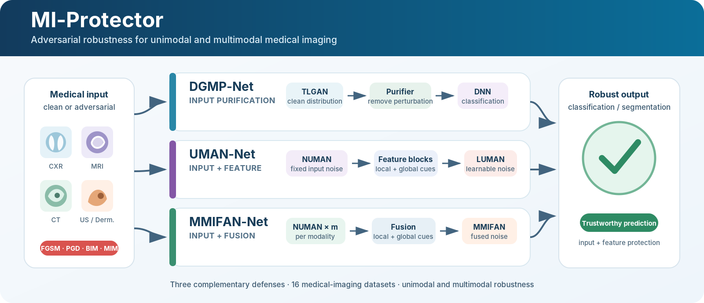

<div align="center">

# MI-Protector

### Towards building robust models for unimodal and multimodal medical imaging data

**Joy Dhar · Puneet Goyal · Maryam Haghighat · Nayyar Zaidi · Ferdous Sohel · Quoc Bao Vo · KC Santosh**

**Information Fusion, Volume 127, Article 103822 (2026)**

[](https://doi.org/10.1016/j.inffus.2025.103822)
[](https://doi.org/10.1016/j.inffus.2025.103822)
[](https://www.python.org/)
[](https://www.tensorflow.org/)
[](https://jupyter.org/)

[Paper](https://www.sciencedirect.com/science/article/pii/S156625352500884X) ·
[DOI](https://doi.org/10.1016/j.inffus.2025.103822) ·
[Datasets](docs/DATASETS.md) ·
[Reproducibility](docs/REPRODUCIBILITY.md) ·
[Citation](#citation)

</div>

<p align="center">
  
</p>

## Overview

**MI-Protector** is a unified adversarial-defense framework for medical image analysis in both **unimodal** and **multimodal fusion** settings. It protects neural networks at the input and/or feature levels through three complementary methods:

- **DGMP** — a Defense Generative Model with Purifier that maps perturbed inputs toward a learned clean-image distribution.
- **UMAN** — UniModal Attention Noise injection combining non-learnable input-level noise (**NUMAN**) and learnable feature-level noise (**LUMAN**).
- **MMIFAN** — MultiModal Information Fusion Attention Noise for robust multimodal representation learning, paired with NUMAN at the input level.

The study evaluates the framework on **16 medical-imaging datasets** spanning classification and segmentation, multiple imaging modalities, standard and stronger attacks, and clinically meaningful Poisson noise.

## At a glance

| Evaluation dimension | Coverage in the paper |
|---|---|
| Tasks | 14 classification datasets and 2 segmentation datasets |
| Modalities | CXR, CT, MRI, ultrasound, dermoscopy, endoscopy, Pap smear, microscopy, and histopathology |
| Classification backbones | VGG16, ResNet18, and ResNet50 |
| Segmentation backbones | PraNet and MADGNet |
| Adversarial attacks | FGSM, PGD, BIM, MIM, Admix, and DeCoWA |
| Defense levels | Example-level, feature/model-level, and dual-level |

## Method

| Method | Learning setting | Defense placement | Core mechanism | Notebook |
|---|---|---|---|---|
| **DGMP-Net** | Unimodal | Example/input level | TLGAN learns the clean distribution; a frozen generator and trainable network form a purifier that removes adversarial perturbations before classification. | [`Code/dgmp-net.ipynb`](Code/dgmp-net.ipynb) |
| **UMAN-Net** | Unimodal | Dual level | **NUMAN** injects non-learnable global-local attention noise at the input; **LUMAN** injects learnable global-local attention noise within feature blocks. | [`Code/uman-net.ipynb`](Code/uman-net.ipynb) |
| **MMIFAN-Net** | Multimodal fusion | Dual-level system | NUMAN protects each modality at the input, while MMIFAN learns fused multimodal local-global attention noise in intermediate feature layers. | [`Code/mmifan-net.ipynb`](Code/mmifan-net.ipynb) |

### DGMP: purification without adversarial training

DGMP contains a **Triplet-Loss-enabled GAN (TLGAN)** and a purifier. TLGAN uses multi-branch encoder/decoder modules with self-attention and Spatial Domain Attention. Its triplet reconstruction objective combines mean-squared error, Kullback-Leibler divergence, and Wasserstein loss. The trained generator is frozen and paired with a neural network to reconstruct purified inputs for downstream classification.

### UMAN: dual-level unimodal defense

UMAN couples two attention-noise mechanisms:

1. **NUMAN** learns global and local input cues and combines them with fixed Gaussian noise.
2. **LUMAN** combines feature-dependent global/local cues with learnable noise and iteratively fuses the resulting attention maps inside residual noise-injection blocks.

### MMIFAN: robust multimodal fusion

MMIFAN extends attention-noise injection to heterogeneous modalities. Modality-specific 1×1 convolutions and global average pooling extract local and global information, fusion operators aggregate the modalities, and learnable feature-layer noise produces robust fused representations.

## Paper-reported results

The table below provides a compact summary. See the paper and supplementary material for complete per-dataset, per-attack, and per-perturbation results.

| Evaluation | Headline result reported in the paper |
|---|---|
| Strong unimodal attacks | UMAN-Net improves over leading defenses by approximately **0.5–10.5 percentage points** across D1–D11 under stronger PGD-100, BIM-100, and MIM-100 evaluations. |
| Multimodal robustness | MMIFAN-Net attains **83.89% mean adversarial accuracy** in the computational-cost summary and outperforms the strongest prior multimodal baseline reported there by **4.6 points**. |
| Robustness–efficiency trade-off | MMIFAN-Net uses approximately **26.7M parameters**, **2.44 GFLOPs**, and **41.2 ms** inference time in the supplementary cost analysis, without an adversarial-training phase. |
| Recent stronger attacks | At ε = 32/255, UMAN-Net improves over leading baselines by about **1–5 points** on Admix/DeCoWA; MMIFAN-Net gains up to approximately **6.3 points**. |
| Segmentation robustness | At ε = 32/255, UMAN-PraNet improves over GATN-UR-PraNet by roughly **1.7–6.3 Dice points**; UMAN-MADGNet improves by roughly **0.6–2.6 points**. |
| Clinical Poisson noise | UMAN-Net is best across λ ∈ {0.10, 0.30, 0.50}, improving over RCNN/GATN-R by approximately **0.5–1.9 points** on the two CT benchmarks. |

> **Metric note:** classification experiments report accuracy; segmentation experiments report Dice score. All values above reproduce the manuscript's own summaries rather than recomputing results from the notebooks.

## Repository structure

```text
MI-Protector/
├── Code/
│   ├── dgmp-net.ipynb      # TLGAN, purifier, and DGMP-Net experiments
│   ├── uman-net.ipynb      # NUMAN/LUMAN and UMAN-Net experiments
│   └── mmifan-net.ipynb    # multimodal NUMAN/MMIFAN experiments
├── assets/
│   └── mi-protector-overview.svg
├── docs/
│   ├── DATASETS.md
│   └── REPRODUCIBILITY.md
├── CITATION.cff
├── citation.bib
├── requirements.txt
└── README.md
```

## Getting started

### 1. Clone the repository

```bash
git clone https://github.com/misti1203/MI-Protector.git
cd MI-Protector
```

### 2. Create a Python environment

The released notebooks record **Python 3.10** in their notebook metadata.

```bash
python -m venv .venv

# Linux/macOS
source .venv/bin/activate

# Windows PowerShell
# .venv\Scripts\Activate.ps1

python -m pip install --upgrade pip
pip install -r requirements.txt
```

### 3. Launch the notebooks

```bash
jupyter lab
```

Open one of the three notebooks under `Code/`, update its dataset-path cell, and run the notebook sequentially.

## Data preparation

Datasets are **not redistributed** in this repository. Download them from their original providers and comply with their licenses and terms of use. The current notebooks preserve dataset-specific Kaggle/local path cells, so these paths must be updated before execution.

The paper uses the following common preprocessing protocol:

- per-image min–max normalization to `[0, 1]`;
- training/validation/test split of `70% / 10% / 20%`;
- classification resolution of `128 × 128 × 3`;
- segmentation resolution of `224 × 224 × 3`;
- training augmentation using 20° rotation, ±5-pixel translation, and 3×3 Gaussian smoothing.

The full dataset inventory is available in [`docs/DATASETS.md`](docs/DATASETS.md).

## Reference experimental configuration

| Item | Paper setting |
|---|---|
| Training epochs | 200 |
| Batch size | 32 |
| Optimizer | Adam |
| Initial learning rate | 1e-3 |
| Scheduler | ReduceLROnPlateau, factor 0.1, patience 10, minimum LR 1e-6 |
| Main hardware | NVIDIA GeForce RTX 4060 Ti |
| VGG16 attacks | FGSM, PGD-20, BIM-20, MIM-20; ε ∈ {0.3, 0.6, 0.9, 1.2} |
| ResNet18/50 attacks | FGSM, PGD-100, BIM-100, MIM-100; ε ∈ {8, 16, 24, 32}/255 |
| Multimodal attacks | PGD-20 and MIM-20; ε = 8/255 to 32/255 in 4/255 increments |
| Additional attacks | Admix, DeCoWA, and stronger PGD sweeps up to 100 steps |

More implementation and reproducibility notes are provided in [`docs/REPRODUCIBILITY.md`](docs/REPRODUCIBILITY.md).

## Release status and reproducibility scope

This release provides the three principal research notebooks corresponding to DGMP-Net, UMAN-Net, and MMIFAN-Net. The notebooks are experiment-oriented and contain dataset-specific path cells and exploratory analysis. The repository does not currently bundle datasets, pretrained checkpoints, archived split manifests, or a unified command-line training pipeline. Exact table-level reproduction therefore requires aligning dataset versions, splits, seeds, paths, and framework versions with the paper setup.

## Citation

Please cite the following article when using this repository:

```bibtex
@article{dhar2026miprotector,
  title   = {Towards building robust models for unimodal and multimodal medical imaging data},
  author  = {Dhar, Joy and Goyal, Puneet and Haghighat, Maryam and Zaidi, Nayyar and Sohel, Ferdous and Vo, Quoc Bao and Santosh, KC},
  journal = {Information Fusion},
  volume  = {127},
  pages   = {103822},
  year    = {2026},
  doi     = {10.1016/j.inffus.2025.103822},
  publisher = {Elsevier}
}
```

A machine-readable citation is also provided in [`CITATION.cff`](CITATION.cff), together with [`citation.bib`](citation.bib).

## Responsible use

This repository is intended for **research and reproducibility**. It is not a clinically validated diagnostic product and must not be used as the sole basis for diagnosis, treatment, triage, or other patient-care decisions. Performance on the reported datasets and attack settings does not establish safety under deployment distribution shifts, adaptive attackers, or untested clinical workflows.

## License

No explicit software license is currently included in the original repository. Unless the authors add a license, standard copyright restrictions apply. Contact the corresponding author before redistributing or reusing the code beyond applicable legal exceptions.

## Contact

For questions about the paper or implementation, contact:

**Joy Dhar** — `joy.22csz0003@iitrpr.ac.in`

---

<div align="center">
  <sub>MI-Protector: adversarial robustness for unimodal and multimodal medical imaging.</sub>
</div>
